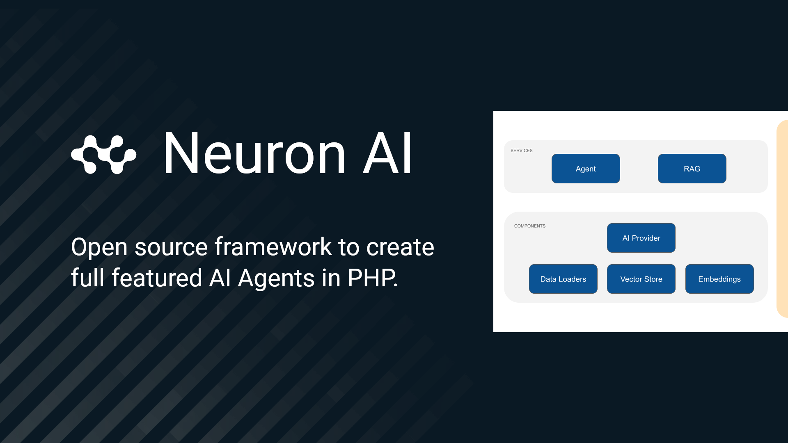

[](https://packagist.org/packages/inspector-apm/neuron-ai)
[](//packagist.org/packages/inspector-apm/neuron-ai)

> Before moving on, support the community giving a GitHub star ⭐️. Thank you!



## Requirements

- PHP: ^8.0

## Official documentation

**[Go to the official documentation](https://neuron.inspector.dev/)**

## Install

Install the latest version of the package:

```
composer require inspector-apm/neuron-ai
```

## Create an Agent

Neuron provides you with the Agent class you can extend to inherit the main features of the framework,
and create fully functional agents. This class automatically manages some advanced mechanisms for you such as memory,
tools and function calls, up to the RAG systems. You can go deeper into these aspects in the [documentation](https://docs.neuron-ai.dev).
In the meantime, let's create the first agent, extending the `NeuronAI\Agent` class:

```php
use NeuronAI\Agent;
use NeuronAI\SystemPrompt;
use NeuronAI\Providers\AIProviderInterface;
use NeuronAI\Providers\Anthropic\Anthropic;

class YouTubeAgent extends Agent
{
    public function provider(): AIProviderInterface
    {
        return new Anthropic(
            key: 'ANTHROPIC_API_KEY',
            model: 'ANTHROPIC_MODEL',
        );
    }

    public function instructions(): string
    {
        return new SystemPrompt(
            background: ["You are an AI Agent specialized in writing YouTube video summaries."],
            steps: [
                "Get the url of a YouTube video, or ask the user to provide one.",
                "Use the tools you have available to retrieve the transcription of the video.",
                "Write the summary.",
            ],
            output: [
                "Write a summary in a paragraph without using lists. Use just fluent text.",
                "After the summary add a list of three sentences as the three most important take away from the video.",
            ]
        );
    }
}
```

The `SystemPrompt` class is designed to take your base instructions and build a consistent prompt for the underlying model
reducing the effort for prompt engineering.

## Talk to the Agent

Send a prompt to the agent to get a response from the underlying LLM:

```php
$agent = YouTubeAgent::make();

$response = $agent->run(new UserMessage("Hi, I'm Valerio. Who are you?"));
echo $response->getContent();
// I'm a friendly YouTube assistant to help you summarize videos.


$response = $agent->run(
    new UserMessage("Do you know my name?")
);
echo $response->getContent();
// Your name is Valerio, as you said in your introduction.
```

As you can see in the example above, the Agent automatically has memory of the ongoing conversation. Learn more about memory in the [documentation](https://docs.neuron-ai.dev/chat-history-and-memory).

## Supported LLM Providers

With Neuron you can switch between LLM providers with just one line of code, without any impact on your agent implementation.
Supported providers:

- Anthropic
- Ollama (also available as an [embeddings provider](https://docs.neuron-ai.dev/components/embeddings-provider#ollama))
- OpenAI
- Mistral
- Deepseek

## Tools & Function Calls

You can add the ability to perform concrete tasks to your Agent with an array of `Tool`:

```php
use NeuronAI\Agent;
use NeuronAI\SystemPrompt;
use NeuronAI\Providers\AIProviderInterface;
use NeuronAI\Providers\Anthropic\Anthropic;
use NeuronAI\Tools\Tool;
use NeuronAI\Tools\ToolProperty;

class YouTubeAgent extends Agent
{
    public function provider(): AIProviderInterface
    {
        return new Anthropic(
            key: 'ANTHROPIC_API_KEY',
            model: 'ANTHROPIC_MODEL',
        );
    }

    public function instructions(): string
    {
        return new SystemPrompt(
            background: ["You are an AI Agent specialized in writing YouTube video summaries."],
            steps: [
                "Get the url of a YouTube video, or ask the user to provide one.",
                "Use the tools you have available to retrieve the transcription of the video.",
                "Write the summary.",
            ],
            output: [
                "Write a summary in a paragraph without using lists. Use just fluent text.",
                "After the summary add a list of three sentences as the three most important take away from the video.",
            ]
        );
    }

    public function tools(): array
    {
        return [
            Tool::make(
                'get_transcription',
                'Retrieve the transcription of a youtube video.',
            )->addProperty(
                new ToolProperty(
                    name: 'video_url',
                    type: 'string',
                    description: 'The URL of the YouTube video.',
                    required: true
                )
            )->setCallable(function (string $video_url) {
                // ... retrieve the video transcription
            })
        ];
    }
}
```

Learn more about Tools on the [documentation](https://docs.neuron-ai.dev/tools-and-function-calls).

## MCP server connector

Instead of implementing tools manually, you can connect tools exposed by an MCP server with the `McpConnector` component:

```php
use NeuronAI\Agent;
use NeuronAI\MCP\McpConnector;
use NeuronAI\Providers\AIProviderInterface;
use NeuronAI\Providers\Anthropic\Anthropic;
use NeuronAI\Tools\Tool;
use NeuronAI\Tools\ToolProperty;

class SEOAgent extends Agent
{
    public function provider(): AIProviderInterface
    {
        return new Anthropic(
            key: 'ANTHROPIC_API_KEY',
            model: 'ANTHROPIC_MODEL',
        );
    }

    public function instructions(): string
    {
        return new SystemPrompt(
            background: ["Act as an expert of SEO (Search Engine Optimization)."]
            steps: [
                "Analyze a text of an article.",
                "Provide suggestions on how the content can be improved to get a better rank on Google search."
            ],
            output: ["Structure your analysis in sections. One for each suggestion."]
        );
    }

    public function tools(): array
    {
        return [
            // Connect an MCP server
            ...McpConnector::make([
                'command' => 'npx',
                'args' => ['-y', '@modelcontextprotocol/server-everything'],
            ])->tools(),

            // Implement your custom tools
            Tool::make(
                'get_transcription',
                'Retrieve the transcription of a youtube video.',
            )->addProperty(
                new ToolProperty(
                    name: 'video_url',
                    type: 'string',
                    description: 'The URL of the YouTube video.',
                    required: true
                )
            )->setCallable(function (string $video_url) {
                // ... retrieve the video transcription
            })
        ];
    }
}
```

Learn more about MCP connector on the [documentation](https://docs.neuron-ai.dev/advanced/mcp-servers-connection).

## Implement RAG systems

For RAG use case, you must extend the `NeuronAI\RAG\RAG` class instead of the default Agent class.

To create a RAG you need to attach some additional components other than the AI provider, such as a `vector store`,
and an `embeddings provider`.

Here is an example of a RAG implementation:

```php
use NeuronAI\Providers\AIProviderInterface;
use NeuronAI\Providers\Anthropic\Anthropic;
use NeuronAI\RAG\Embeddings\EmbeddingsProviderInterface;
use NeuronAI\RAG\Embeddings\VoyageEmbeddingProvider;
use NeuronAI\RAG\RAG;
use NeuronAI\RAG\VectorStore\PineconeVectoreStore;
use NeuronAI\RAG\VectorStore\VectorStoreInterface;

class MyChatBot extends RAG
{
    public function provider(): AIProviderInterface
    {
        return new Anthropic(
            key: 'ANTHROPIC_API_KEY',
            model: 'ANTHROPIC_MODEL',
        );
    }

    public function embeddings(): EmbeddingsProviderInterface
    {
        return new VoyageEmbeddingProvider(
            key: 'VOYAGE_API_KEY',
            model: 'VOYAGE_MODEL'
        );
    }

    public function vectorStore(): VectorStoreInterface
    {
        return new PineconeVectoreStore(
            key: 'PINECONE_API_KEY',
            indexUrl: 'PINECONE_INDEX_URL'
        );
    }
}
```

Learn more about RAG on the [documentation](https://docs.neuron-ai.dev/rag).

## Official documentation

**[Go to the official documentation](https://neuron.inspector.dev/)**

## Contributing

We encourage you to contribute to the development of Neuron AI Framework!
Please check out the [Contribution Guidelines](CONTRIBUTING.md) about how to proceed. Join us!

## LICENSE

This bundle is licensed under the [MIT](LICENSE) license.
